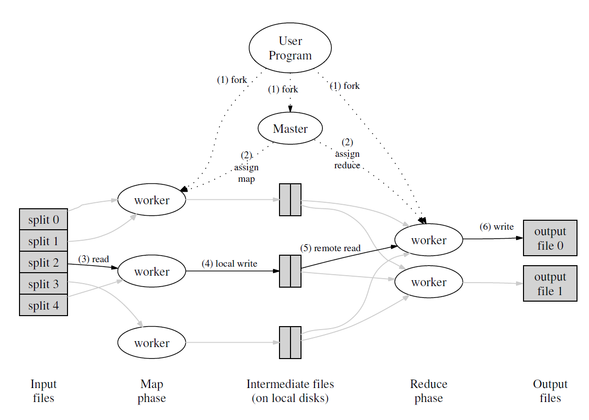
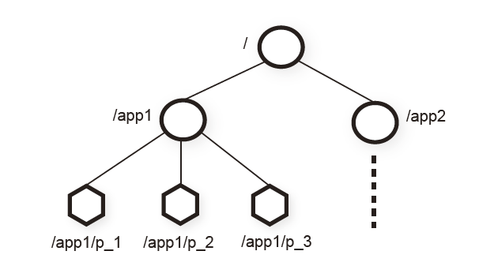

# Lecture 1: Introduction

This is a course about infrastructure for applications.
* Storage.
* Communication.
* Computation.

A big goal: hide the complexity of distribution from applications.

**Topic: fault tolerance**
* 1000s of servers, big network -> always something broken
  * We'd like to hide these failures from the application.
  * "High availability": service continues despite failures
* Big idea: replicated servers.
  * If one server crashes, can proceed using the other(s).
  * Labs 2 and 3

**Topic: consistency**
* General-purpose infrastructure needs well-defined behavior.
  * E.g. "Get(key) yields the value from the most recent Put(key,value)."
* Achieving good behavior is hard!
  * e.g. "Replica" servers are hard to keep identical.

**Topic: performance**
* The goal: scalable throughput
  * Nx servers -> Nx total throughput via parallel CPU, RAM, disk, net.
* Scaling gets harder as N grows:
  * Load imbalance.
  * Slowest-of-N latency.
  * Some things don't speed up with N: initialization, interaction.

**Topic: tradeoffs**
* Fault-tolerance, consistency, and performance are enemies.
* Fault tolerance and consistency require communication
  * e.g., send data to backup server
  * e.g., check if cached data is up-to-date
  * communication is often slow and non-scalable
* Many designs sacrifice consistency to gain speed.
  * e.g. Get() might *not* yield the latest Put()!
  * Painful for application programmers (or users).
* We'll see many design points in the consistency/performance spectrum.

**Topic: implementation**
* RPC, threads, concurrency control, configuration.
* The labs...

This material comes up a lot in the real world.
* All big web sites and cloud providers are expert at distributed systems.
* Many big open source projects are built around these ideas.
* We'll read multiple papers from industry.
* And industry has adopted many ideas from academia.

## MapReduce

```txt
Abstract view of a MapReduce job -- word count
  Input1 -> Map -> a,1 b,1
  Input2 -> Map ->     b,1
  Input3 -> Map -> a,1     c,1
                    |   |   |
                    |   |   -> Reduce -> c,1
                    |   -----> Reduce -> b,2
                    ---------> Reduce -> a,2
  1) input is (already) split into M files
  2) MR calls Map() for each input file, produces list of k,v pairs
     "intermediate" data
     each Map() call is a "task"
  3) when Maps are done,
     MR gathers all intermediate v's for each k,
     and passes each key + values to a Reduce call
  4) final output is set of <k,v> pairs from Reduce()s

Word-count-specific code
  Map(k, v)
    split v into words
    for each word w
      emit(w, "1")
  Reduce(k, v_list)
    emit(len(v_list))
```
**shuffle**

为了收集所有特定key的输出，并将它们传递给某个机器的Reduce函数，还是需要网络通信(RPC)

所以，这里确实需要将每一份数据都通过网络从创建它的Map节点传输到需要它的Reduce节点。所以，这也是MapReduce中代价较大的一部分。

shuffle的重点是，这里实际上可能会有大量的网络通信



- `Worker`: 分布式系统中不同计算机上运行的进程
- `Master`: 也是一个计算机上的进程, 负责协调整个处理过程，包括分配任务、监控进度和处理失败的工作节点
- `Task`: 计算任务, 包括`Reduce`和`Map`
- `Map`: 一个用用户程序提供的函数, 用于将输入的`key:value`转化为一组`mid-key:mid-value`
- `Reduce`: 一个用用户程序提供的函数, 用于将输入的`mid-key:[]mid-value`转化为输出`output`

通常, `Master`将`Map`和`Reduce`作为任务分配给`Worker`进行计算, 称为`Map Task`和`Reduce Task`, 以下是其一次`MapReduce`任务(称为`Job`)执行的过程:

1. 文件分片
   通常是在任务开始之前由`Master`完成的。这是初始化阶段的一部分
2. `Master`分配`Map Task`
   `Master`将分片信息分配给`Worker`节点, 例如: 最开始将`切割的文件名和文件内容`作为`key:value`通过`RPC`提供给`worker`使其利用提供的`map func`进行计算, 这也是`lab 1`中的工作方式
3. `Map Task`执行
   `Map Task`的计算过程除了利用`map func`进行计算外, 还需要将输出的多个`mid-key:mid-value`分割成片存储于不同的本地文件, 不同的分片将提供给不同的`Reduce Task`, 通常使用`Hash`函数并对取`Reduce Task`的数量模得到分片序号。执行`Map Task`的`Worker`在执行结束后报告`Master`某个`Map Task`的执行情况
4. `Master`等待所有的`Map Task`执行成功
   `Master`根据`Worker`对`Map Task`的执行情况的报告进行决策, 保证所有的`Map Task`执行成功
5. `Master`分配`Reduce Task`
   `Master`会给`Worker`分配某个`Reduce Task`， `Worker`根据其任务序号读取之前所有`Map Task`对应分片的内容，这也是为什么要等待所有的`Map Task`执行成功后才执行`Reduce Task`，这样才能保证`Reduce Task`不遗漏`mid-key`, 整合这分片文件后遍历所有的`mid-key:[]mid-value`并应用`reduce func`, 并存储输出结果。同样， 执行`Reduce Task`的`Worker`在执行结束后报告`Master`某个`Reduce Task`的执行情况
6. `Master`协调所有的`Reduce Task`执行成功
   `Master`根据`Worker`对`Reduce Task`的执行情况的报告进行决策, 保证所有的`Reduce Task`执行成功

最后, 不同的`Job`可以链式执行, 前一个`Job`的输出可以作为下一个`Job`的输入, 以此实现负责而庞大的计算任务

- 心跳信号
  `Worker`只需要向`Master`发送心跳信号表示自身的存活, 如果Master在预定时间内没有收到来自某个`Worker`的心跳，它就会将该`Worker`标记为失效，并将其上运行的所有`Map`和`Reduce`任务重新调度到其他节点上。不过这种设计不太会再`lab 1`中出现, 因为这样会使`Master`记录太多有关`Task`和`Worker`的信息, 设计相对复杂
- 超时重试
  如果一个`Worker`节点在执行`Map`或`Reduce`任务耗时过长，`Master`会检测到这种情况。`Master`将其认定为失败, 可以将失败的任务重新分配给其他健康的`Worker`节点执行。这种重试机制可以处理机器故障、软件错误或其他导致任务失败的问题。
- `checkpoints`
  `Master`会周期性地写入`checkpoints`到磁盘以预备可能的崩溃恢复
- 原子重命名
  将`Map`和`Reduce`任务的输出写入到一个命名好的临时文件，并且只在任务成功完成时才对其进行重命名，来实现任务的幂等性。
- 文件系统备份
  在`MapReduce`框架中，输入数据通常存储在一个分布式文件系统（如`GFS`）中，该文件系统会将数据块复制到多个节点上。这种数据副本机制确保了即使某些机器发生故障，数据仍然可用。

# Lecture 2: Threads and RPC

race test

```go
go run -race ***.go
```

## Condition Variable

```go
import "sync"
var mu sync.Mutex
cond := sync.NewCond(&mu)

go func(){
    mu.Lock()
    defer mu.Unlock()
    cond.Broadcast()    
}()

cond.Wait()
```

操作系统里条件变量和互斥锁一起使用！

- `Wait`：调用这个方法会阻塞调用协程，直到其他协程在相同的条件变量上调用 Signal 或 Broadcast。
- `Signal`：唤醒等待该条件变量的一个协程（如果存在的话）。
- `Broadcast`：唤醒等待该条件变量的所有协程。

### WaitGroup

`sync.WaitGroup `用于等待一组协程的完成。一个 `WaitGroup` 等待一系列的事件，主要的用法包括三个方法：

- `Add` 方法: 在启动协程之前，使用 `Add` 方法来设置要等待的事件数量。通常这个值设置为即将启动的协程的数量。
- `Done` 方法: 当协程的工作完成时，调用 `Done` `方法。Done` 方法减少 `WaitGroup` 的内部计数器，通常等价于 `Add(-1)`。
- `Wait` 方法: 使用 Wait 方法来阻塞，直到所有的事件都已通过调用 `Done` 方法来报告完成。

```go
// 假设我们有三个并行的任务需要执行
    tasks := 3

    // 使用Add方法来设置WaitGroup的计数器
    wg.Add(tasks)

    for i := 1; i <= tasks; i++ {
        // 启动一个协程
        go func(i int) {
            defer wg.Done() // 确保在协程的末尾调用Done来递减计数器
            time.Sleep(2 * time.Second) // 模拟耗时任务
            fmt.Printf("Task %d finished\n", i)
        }(i)
    }

    // Wait会阻塞，直到WaitGroup的计数器减为0
    wg.Wait()
```

1. 不要复制 `WaitGroup`。如果需要将 WaitGroup 传递给函数，应使用指针。
2. 避免在协程内部调用 `Add` 方法，因为这可能会导致计数器不准确。最好在启动协程之前添加所需的计数。
3. 使用 `Done` 方法是减少 `WaitGroup` 计数器的推荐方式，它等价于 `Add(-1)`。

## channel

- 不带缓冲的通道在发送操作和接收操作之间进行同步：发送会阻塞，直到有另一个协程来接收数据；接收会阻塞，直到有另一个协程发送数据。
- 带缓冲的通道有一个固定大小的缓冲区。发送操作只在缓冲区满时阻塞，接收操作只在缓冲区空时阻塞。

### select

`select`允许协程在多个通道操作上等待。select 会阻塞，直到其中一个通道操作可以执行：

```go
select {
    case msg := <-ch1:
        // 从ch1接收消息
    case ch2 <- msg:
        // 发送消息到ch2
    default:
        // 如果以上都不可执行，则执行默认操作（非阻塞）
}
```

## Context

`Context 类型`用于创建和操纵上下文的函数,用于定义截止日期、取消信号以及其他请求范围的值的接口。它设计用来传递给请求范围的数据、取消信号和截止时间到不同的协程中，以便于管理它们的生命周期。先来看`Context 接口`:
`Context` 接口定义了四个方法：

1. `Deadline`：返回 `Context` 被取消的时间，也就是完成工作的截止时间（如果有的话）。
2. `Done`：返回一个 `Channel`，这个 `Channel` 会在当前工作应当被取消时关闭。
3. `Err`：返回 `Context` 结束的原因，它只会在 `Done` 返回的 `Channel` 被关闭后返回非空值。
4. `Value`：从 `Context` 中检索键对应的值。

`context` 包提供了几个用于创建和操纵上下文的函数：

1. `context.Background`：返回一个空的 `Context`。这个 `Context` 通常被用作整个程序或请求的顶层 `Context`。
2. `context.TODO`：不确定应该使用哪个 `Context` 或者还没有可用的 `Context` 时，使用这个函数。这在编写初始化代码或者不确定要使用什么上下文时特别有用。
3. `context.WithCancel`：创建一个新的 `Context`，这个 `Context` 会包含一个取消函数，可用于取消这个 `Context` 及其子树。
4. `context.WithDeadline`：创建一个新的 `Context`，这个 `Context` 会在指定的时间到达时自动取消。
5. `context.WithTimeout`：创建一个新的 `Context`，这个 `Context` 会在指定的时间段后自动取消。

```go
package main

import (
	"context"
	"fmt"
	"time"
)

func operation(ctx context.Context, duration time.Duration) {
	select {
	case <-time.After(duration): // 模拟一个耗时操作
		fmt.Println("Operation done.")
	case <-ctx.Done(): // 检测 context 的取消事件
		fmt.Println("Operation canceled:", ctx.Err())
	}
}

func main() {
	// 创建一个可取消的 context
	ctx, cancel := context.WithCancel(context.Background())

	// 在一个新的协程中运行 operation 函数
	go operation(ctx, 5*time.Second)

	// 模拟在 operation 运行一段时间后取消操作
	time.Sleep(2 * time.Second)
	cancel() // 取消 context

	// 给 operation 一些时间来处理取消事件
	time.Sleep(1 * time.Second)
}
```

```go
//有两个 goroutine 分别用于从客户端读取数据并写入目的端，以及从目的端读取数据并写入客户端, 要求一旦有一个方向的拷贝操作出现错误, 将另一个操作也取消
ctx, cancel := context.WithCancel(context.Background())
defer cancel()

go func() {
	_, _ = io.Copy(dest, reader)
	cancel()
}()
go func() {
	_, _ = io.Copy(conn, dest)
	cancel()
}()

<-ctx.Done()
```

- 方案:使用`WithCancel`和`<-ctx.Done()`:

`cancel` 函数与 `ctx` 相关联，而 `cancel` 被闭包捕获并在多个 `goroutine` 中使用。这就是为什么调用` cancel()` 会影响所有这些 goroutine 的原因，不管 `ctx` 是否被显式传递。这种行为是 `context` 包设计的一部分，允许协调不同 `goroutine` 之间的取消事件。cancel() 被调用时会取消 `ctx` 上下文，而与这个 `ctx` 相关联的所有操作（在这个例子中是两个 `io.Copy` 调用）都会接收到取消通知，即使它们在不同的 `goroutine` 中执行，且 `ctx` 没有显式地传递给它们。

- 不应该把 `Context` 存储在结构体中，它应该通过参数传递。
- `Context` 是协程安全的，你可以把一个 `Context` 传递给多个协程，每个协程都可以安全地读取和监听它。
- 一旦一个 `Context` 被取消，它的所有子 `Context` 都会被取消。
- `Context` 的 `Value` 方法应该被用于传递请求范围的数据，而不是函数的可选参数。

`Context` 在处理跨越多个协程的取消信号、超时以及传递请求范围数据时起到了关键作用，是 Go 并发编程中的重要组件。

## RPC

Go 标准库中的 `net/rpc` 包提供了创建 `RPC` 客户端和服务器的机制。
RPC 允许客户端程序调用在服务器上运行的程序的函数或方法，就好像它是本地可用的一样。客户端和服务器之间的通信通常是透明的，客户端程序仅需知道需要调用的远程方法和必须提供的参数。
`net/rpc` 包使用了 Go 的编码和解码接口，允许使用 `encoding/gob` 包来序列化和反序列化数据（尽管也可以使用其他编码，如 `JSON`）。`RPC` 调用默认是通过 `TCP` 或者 `UNIX` 套接字传输的，但是你可以实现自己的传输方式。

要创建一个 `Go RPC` 服务器，你需要创建一些方法，这些方法必须满足以下条件：

1. 方法是导出的（首字母大写）。
2. 方法有两个参数，都是导出类型或内建类型。
3. 方法的第二个参数是指针, 相当于写出。
4. 方法返回一个 `error` 类型。

然后，将这个类型的实例注册为 RPC 服务：

```go
type Arith int

func (t *Arith) Multiply(args *Args, reply *int) error {
    *reply = args.A * args.B
    return nil
}

func main() {
    arith := new(Arith)
    rpc.Register(arith)
    rpc.HandleHTTP()
    err := http.ListenAndServe(":1234", nil)
    if err != nil {
        log.Fatal("ListenAndServe: ", err)
    }
}
```

客户端需要使用 `rpc.Dial` 函数连接到 RPC 服务器，然后可以通过 `Call` 方法进行同步调用或 `Go` 方法进行异步调用：

```go
client, err := rpc.Dial("tcp", "server address")
if err != nil {
    log.Fatal("dialing:", err)
}

// Synchronous call
args := &Args{7, 8}
var reply int
err = client.Call("Arith.Multiply", args, &reply)
if err != nil {
    log.Fatal("arith error:", err)
}
fmt.Printf("Arith: %d*%d=%d", args.A, args.B, reply)
```

# Lecture 2.5: Consistency, Linearizability

```txt'
 today: linearizability
  but we'll also see:
    eventual consistency
    causal consistency
    fork consistency
    serializability
  driving force: performance / convenience / robustness tradeoffs

linearizability outlaws many attractive design possibilities / mistakes:
  split brain (two active leaders)
  forgetting completed writes after a crash+reboot
  reading from lagging replicas
```

```txt
so linearizability often allows multiple different outcomes.
so we often can't predict in advance, but we can check afterwards.
so, if we want linearizability:
  can't un-do a revealed write (e.g. if crash causes server to forget).
  can't reveal divergent replicas to clients.
so:
  the service can pick either order for concurrent writes.
  the linear order can be different from start-time or end-time order!
so:
  service can choose either order for concurrent writes
  but all clients must see the writes in the same order
  this is important when there are replicas or caches
    they all have to execute operations in the same order
so:
  reads must return fresh data: stale values aren't linearizable
  even if the reader doesn't know about the write
    the time rule requires reads to yield the latest data
 so, if we want linearizability:
  duplicate requests from retransmissions must be suppressed!
```

比较重要的一点

```
what does linearizabilty say?
C1: |-Wx3-|          |-Wx4-|
C2:          |-Rx3-------------|
C2's first request before Wx4, re-sends after Wx4
a valid order: Wx3 Rx3 Wx4
so: returning the old saved value 3 is correct
    returning 4 is also correct! (but only b/c read has no side-effects)
```

线性一致性是指一个系统表现得就像只有一个服务器，并且服务器没有故障，每次执行一个客户端请求，并且没有奇怪的事情发生

如果能构建一个操作序列, 满足每个才做读取的值都是前一个操作实际写入的结果, 那么其就是线性一致的

换言之，**不允许一个存储在系统中的数据有不同的演进过程。**

# Lecture 3: GFS

### Others


1. `Master`
   `GFS`中的中心节点，负责管理文件系统的全局视图。`Master`节点保存了所有文件的元数据，这包括文件和目录的命名空间结构、每个文件的`chunks`信息、每个`chunk`的位置以及每个操作的日志。`Master`调度客户端对`chunks`的读写请求，并处理命名空间的修改和访问控制。
2. `Chunkserver`
   `Chunkserver`是GFS中的工作节点，负责存储实际的文件数据。文件数据被分割成多个`chunks`，每个`chunk`通常大小为64MB（可进行配置）。每个`Chunkserver`可能会存储数千个这样的`chunks`，并负责处理来自客户端的读写请求。它们向`Master`报告存储的`chunks`的状态，并根据`Master`的指示执行诸如创建副本或删除旧副本等操作。本质上, `Chunkserver`就是一个`Linux`的管理文件的进程。
3. `Client`
   `Client`指的是使用GFS存储数据的应用程序。客户端通过`GFS`提供的`API`(其实就是链接一个库)与文件系统进行交互。客户端会先与`Master`节点通信以获取文件元数据和`chunks`的位置信息，然后直接与一个或多个`chunkservers`通信进行数据的读写操作。
4. `Chunk`
   文件分割的基本单位，是数据存储的块。每个`chunk`由`Chunkserver`存储和管理，具有固定的大小，例如64MB。通过使用固定大小的`chunks`，`GFS`能够简化存储管理，并且优化大规模数据的读写效率。文件有多少个`Chunk`, 每个`Chunk`在什么位置, 这些信息都存在`Master`的内存中。
5. `Chunk Handle`
   `Chunk Handle`是`GFS`分配给每个chunk的唯一标识符。它是一个全局唯一的64位值，用于标识和引用存储在`chunkservers`上的特定`chunk`。`Chunk Handle`在`chunk`的整个生命周期中保持不变，即使其副本在不同的`chunkservers`之间移动或复制。
6. `Chunk Location`
   `Chunk Location`是指存储特定`chunk`的`Chunkserver`的网络地址。Master节点跟踪每个`chunk`的所有副本的位置，并将这些位置信息提供给客户端，以便客户端可以直接与存储所需`chunks`的`Chunkserver`建立连接进行数据读写。

`GFS`的架构特点可以总结如下:

1. 单`Master`
   所有文件系统元数据(包括文件系统命名空间、文件名与`chunk`的映射关系、`chunk`的位置、`chunk`版本号、日志等)都存储在单个`Master`节点的内存中
2. 文件分块
   件被切分成固定大小的`chunks`, `chunkservers`将`chunks`存储在本地磁盘上作为`Linux`文件, `chunks`在多个`chunkservers`中备份存储
3. 心跳同步
   `chunkservers`与`master`通过心跳函数进行信息交互
4. 数据和指令分开传送
   `client`与`Master`节点交互来进行元数据操作，比如打开文件、获取文件信息、获取`chunk`位置等。之后， `client`直接与Chunkserver节点交互来进行实际的数据读写
5. 租约（`Leases`）机制
   (此机制未在架构图中体现)`Master`节点给某个`chunk`的一个副本授予租约，该副本被称为`primary chunk`。持有租约的`Chunkserver`有责任在写操作中协调其他副本（`secondary chunks`）的更新顺序。

#### Leases

租约机制主要是用于协调分布式环境下的多个对相同`chunk`的变更操作, 因为多个变更操作的变更顺序很重要, 所有副本在应用变更时都遵循这个顺序。`Leases`的设计思路是将某一时间段内的处理任务交付给某一个`chunkserver`完成, 称为其获得了租约(`lease`),

具体流程为:

1. `client`询问`master`哪个数据块服务器持有当前对于该数据块的租约，以及其他副本的位置。如果没有任何副本持有租约，`master`会选择一个副本授予租约（未展示）, 这个被授予租约的`server`称为`primary replica`, 其协调的`server`称为`secondary replica`。
2. `master`回复`client`其`primary replica`的身份和其他（次级）副本的位置。`client`缓存这些数据以用于未来的变更。只有当`primary replica`变得无法联系，或者回复说它不再持有租约时，`client`才需要再次联系`master`。
3. `client`将数据推送到所有副本。`client`可以按任何顺序这么做。每个数据块服务器都会将数据存储在一个内部的`LRU`缓冲区中，直到数据被使用或者过时。通过将数据流与控制流解耦，我们可以根据网络拓扑优化昂贵的数据流的调度，而不考虑哪个数据块服务器是`primary replica`。第3.2节将进一步讨论这一点。
4. 所有副本确认收到数据后，`client`向`primary replica`发送写请求。该请求标识了之前推送给所有副本的数据。`primary replica`为它接收到的所有变更分配连续的序列号，可能来自多个`client`，这提供了必要的序列化。它按照序列号顺序将变更应用到自己的本地状态。
5. `primary replica`将写请求转发给所有次级副本。每个次级副本按照`primary replica`分配的相同序列号顺序应用变更。
6. 所有次级副本都回复`primary replica`，表明它们已经完成了操作。
7. `primary replica`回复`client`。在任何副本遇到的任何错误都会报告给`client`。如果出现错误，写操作可能已经在`primary replica`和任意子集的次级副本上成功。（如果在`primary replica`上失败，它不会被分配序列号并转发。）`client`请求被视为失败，而且被修改的区域处于不一致状态。我们的`client`代码通过重试失败的变更来处理此类错误。在回退到从写操作开始的重试之前，它会在步骤（3）到（7）中尝试几次。


### Hychen11

Sharding 将数据分割放到大量的服务器上，这样就可以并行的从多台服务器读取数据

Snapshot 在某一时刻系统、文件或数据状态的完整拷贝

GFS中Master是Active-Standby模式，所以只有一个Master节点在工作

有大量的Chunk服务器，可能会有数百个，每一个Chunk服务器上都有1-2块磁盘

```txt
Capacity story?
  big files split into 64 MB chunks
  each file's chunks striped/sharded over chunkservers, so a file can be much larger than any one disk
  each chunk in a Linux file
  
Throughput story?
  clients talk directly to chunkservers to read/write data
  if lots of clients access different chunks, huge parallel throughput
  read or write

Fault tolerance story?
  each 64 MB chunk stored (replicated) on three chunkservers
  client writes are sent to all of a chunk's copies
  a read just needs to consult one copy
  
What are the steps when client C wants to read a file?
  1. C sends filename and offset to coordinator (CO) (if not cached), offset is Size/64MB
     CO has a filename -> array-of-chunkhandle table
     and a chunkhandle -> list-of-chunkservers table
  2. CO finds chunk handle for that offset
  3. CO replies with chunkhandle + list of chunkservers
  4. C caches handle + chunkserver list
  5. C sends request to nearest chunkserver
     chunk handle, offset
  6. chunk server reads from chunk file on disk, returns to client
  
Idea: primary/secondary replication
  (or primary/backup)
  For each chunk, designate one server as "primary".
  Clients send write requests just to the primary.
    The primary alone manages interactions with secondary servers.
    (Some designs send reads just to primary, some also to secondaries)
  The primary chooses the order for all client writes.
    Tells the secondaries -- with sequence numbers -- so all replicas
    apply writes in the same order, even for concurrent client writes.
  There are still many details to fill in, and we'll
    see a number of variants in upcoming papers.
 
What are the steps when C wants to write a file at some offset?
  paper's Figure 2
  1. C asks CO about file's chunk @ offset
  2. CO tells C the primary and secondaries
  3. C sends data to all (just temporary...), waits for all replies (?)
  4. C asks P to write
  5. P checks that lease hasn't expired
  6. P writes its own chunk file (a Linux file)
  7. P tells each secondary to write (copy temporary into chunk file)
  8. P waits for all secondaries to reply, or timeout
     secondary can reply "error" e.g. out of disk space
  9. P tells C "ok" or "error"
  10. C retries from start if error
  
What is a lease?
  Permission to act as primary for a given time (60 seconds).
  Primary promises to stop acting as primary before lease expires.
  Coordinator promises not to change primaries until after expiration.
  Separate lease per actively written chunk.
```

# Lecture 4 VMware FT

### Replication

### State Transfer and Replicated State Machine

两种复制的方法，一种是状态转移（State Transfer），另一种是复制状态机（Replicated State Machine）

传统的主从备份的复制方法称为**状态转移**（State Transfer），备份服务器几乎连续地将主服务器的所有状态更改进行传输到备份服务器，包括CPU、内存和I/O设备的更改。然而，发送这些状态所需的带宽，特别是内存中的变化，可能非常大。

本文使用了**复制状态机**（Replicated State Machine）以减小带宽需求，其思想是将服务器建模为**确定性状态机**，通过从相同的初始状态开始，并确保它们以相同的顺序接收相同的输入请求来保持同步。

**状态转移**是复制主节点内存或寄存器中的内容, **复制状态机**是传输来自客户端的操作或其他外部事件。使用复制状态机的主要原因是，外部操作或事件通常比服务的状态要小很多

**容错虚拟机VM**的基本设置。左边是**主VM**，右边是**备份VM**，他们运行在不同的物理服务器上。**备份VM**与**主VM**保持同步并执行相同的操作，尽管会有小的时间延迟。工作时，只有主VM在网络上宣告其存在，即只有**主VM**产生实际的输出并返回给客户端，**备份VM**的输出被丢弃。**主VM**接收的所有输入都通过一个称为`logging channel`的通道发送给**备份VM**。

系统使用服务器之间的**心跳**和对`logging channel`的监控来判断是否有`VM`宕机。

`VM`的输入包括了常规的输入和**非确定性输入**, 常规的输入包括:网络数据、磁盘数据、键盘和鼠标输入等， **非确定性输入**主要包括虚拟中断和非确定性操作。

**确定性重放**将一个`VM`的输入和所有与`VM`执行相关的可能的非确定性输入都写入到日志文件中。通过从文件中读取日志条目，可以稍后完全精确地重放`VM`执行。对于非确定性事件，如**定时器**或**IO中断**，其确切指令也被记录下来。在重放期间，事件在指令流中的相同点被传递。

#### 非确定性事件的处理

**什么是非确定性事件?**

> 不由当前内存直接决定的指令, 其在`Primary`和`Backup`的运行结果可能会不一样。这些指令就是所谓的非确定性事件。

###### 非确定性事件分类

**客户端输入**
为什么客户端输入是非确定性事件? 因为客户端的输入实际上是网络报文。网络报文的数据会被网卡的`DMA`拷贝到内存，之后触发一个中断。尽管这个过程在`Primary`和`Backup`中是一样的， 但中断触发的时间是不确定的（大概率不一样），因此中断的触发打乱了指令流

**特殊指令**

1. 日期相关指令
2. 随机数相关指令
3. 获取`CPU ID`等类似的硬件相关的指令

**多核场景**

指令在多个CPU上会交错运行，其指令顺序不可预期(目前不考虑次场景)

> PS: 这里的多核指的是`Primary`和`Backup`虚机操作系统的硬件是单核的, `VMM`以下的硬件一定是多核的

#### 日志设计

日志设计**可以处理**以上的非确定性事件分类, 日志应当包含如下内容:

1. 事件发生时的指令序号
   `Backup`按照指令序号执行命令
2. 日志条目的类型
   可以判断这个指令是不是非确定性事件
3. 数据

#### 输出控制（Output Rule）

在这个系统中，唯一的输出就是对于客户端请求的响应。客户端通过网络数据包将数据送入，服务器的回复也会以网络数据包的形式送出。我之前说过，Primary和Backup虚机都会生成回复报文，之后通过模拟的网卡送出，但是只有Primary虚机才会真正的将回复送出，而Backup虚机只是将回复简单的丢弃掉。

10,10, primary crash, backup dont receive log and command, so client twice +1 only receive two 11

**解决方法**就是控制输出（Output Rule）。直到Backup虚机确认收到了相应的Log条目，Primary虚机不允许生成任何输出

#### 重复输出

考虑以下的场景:

1. `Primary`在客户端收到了回复后崩溃
2. `Backup`上线, 但其还没有处理完缓冲区的`log`
3. `Backup`处理完`log`后, 由于自己已经上线, 其将输出发送给客户端
4. 客户端收到了2个相同的输出

几乎所有的分布式场景都会遇到类似以上的重复输出的问题, 常规的解决方法是在客户端形成一套重复检测机制。

在`VMWare FT`中, 客户端通过`TCP`与服务进行交互, 而`Backup`由于与`Primary`状态相同, 其`TCP`报文也具有相同的序列号, 因此`VMWare FT`可以在客户端通过`TCP`简单地实现去重。

### Test-and-Set

一个非常常见的场景就是，Primary和Backup都在运行，但是它们之间的网络出现了问题，同时它们各自又能够与一些客户端通信。这时，它们都会以为对方挂了，自己需要上线并接管服务。所以现在，我们对于同一个服务，有两个机器是在线的。因为现在它们都不向彼此发送Log条目，它们自然就出现了分歧。它们或许会因为接收了不同的客户端请求，而变得不一样。脑裂（Split Brain）

**解决这个问题的方法**是，向一个外部的第三方权威机构求证，来决定Primary还是Backup允许上线。这里的第三方就是Test-and-Set服务

Test-and-Set服务不运行在Primary和Backup的物理服务器上，VMware FT需要通过网络支持Test-and-Set服务。这个服务会在内存中保留一些标志位，当你向它发送一个Test-and-Set请求，它会设置标志位，并且返回旧的值。Primary和Backup都需要获取Test-and-Set标志位，这有点像一个锁。为了能够上线，它们或许会同时发送一个Test-and-Set请求，给Test-and-Set服务。当第一个请求送达时，Test-and-Set服务会说，这个标志位之前是0，现在是1。第二个请求送达时，Test-and-Set服务会说，标志位已经是1了，你不允许成为Primary。对于这个Test-and-Set服务，我们可以认为运行在单台服务器。当网络出现故障，并且两个副本都认为对方已经挂了时，Test-and-Set服务就是一个仲裁官，决定了两个副本中哪一个应该上线。


# Lecture 5: Raft 1


### Split Brain

VMware FT依赖这个Test-and-Set服务来确定Primary虚机，所以，为了提高系统的容错性，我们来构建一个多副本的Test-and-Set服务


### Majority Vote

首先你要有奇数个服务器。然后为了完成任何操作，例如Raft的Leader选举，例如提交一个Log条目，在任何时候为了完成任何操作，你必须凑够过半的服务器来批准相应的操作

如果系统有 2 * F + 1 个服务器，那么系统最多可以接受F个服务器出现故障，仍然可以正常工作

选举Raft的Leader，那么每一个操作对应的过半服务器，必然至少包含一个服务器存在于上一个操作的过半服务器中。也就是说，任意两组过半服务器，至少有一个服务器是重叠的。实际上，相比其他特性，Raft更依赖这个特性来避免脑裂

> 当一个Raft Leader竞选成功，那么这个Leader必然凑够了过半服务器的选票，而这组过半服务器中，必然与旧Leader的过半服务器有重叠。所以，新的Leader必然知道旧Leader使用的任期号（term number）

### Raft


Raft的上层，是应用程序代码。例如对于Lab 3来说，这部分应用程序代码就是一个Key-Value数据库

**接口函数说明**

1. `Start`函数
   应用程序通过`Start`函数将一个操作传递给`Raft`层，返回值包括，这个请求将会存放在`Log`中的索引(如果成功`commit`的话)，还会返回当前的任期号(`term number`)

2. `applyCh channel`
   当之前请求的操作`commit`之后, 通过`applyCh channel`向应用程序发出消息通知, 应用程序读取这个消息。

   Raft层通知的，不一定是最近一次Start函数传入的请求。例如在任何请求commit之前，可能会再有超过100个请求通过Start函数传给Raft层。

### Leader Election

#### 选举机制

每一个运行的`raft`节点都包含一个任期号(`Term`), 每个任期只能有一个`Leader`。

如何保证每个任期只能有一个`Leader`？

首先， 每一个运行的`raft`节点只能是如下几个角色之一：

- `Leader`
- `Follower`
- `Candidate`

每个`Raft`节点都有一个选举定时器, 每次收到心跳`RPC`或追加`log`的`RPC`(都通过`AppendEntries`)时, 都将重置这个选举定时器, 在选举定时器没有到期时, 发出`AppendEntries`的节点是`Leader`, 接收`AppendEntries`的节点是`Follower`, 一旦因为没有接收到消息导致选举定时器到期, 节点转化为`Candidate`并进行投票选举。

每一次选举会增加`Term`，通过`RequestVote`向其他节点寻求投票, 由于节点数量是奇数, 而投票选举成功要求过半的投票, 因此只有一个`Leader`将在一个特定的`Term`内选举成功。

拿到过半投票的`Leader`将通过心跳告知新`Leader`的诞生, 如果没有这样的节点, 则再次自增`Term`进行新一轮的选举。

#### Split Vote

因为每个`Candidate`都会给自己投票, 因此如果所有的`Follower`同时转化为`Candidate`并发起选举, 结果一定是各自一张投票, 形成了选票分裂(`Split Vote`), 并且恶心循环地再次进行新一轮选举。

为了避免这种情况，不同的服务器都应该选取随机的超时时间。先超时的节点有更大的概率获得更多的选票，因此避免了多次选票分裂的情况。

> PS: 选举超时的设定要求: 至少大于`Leader`的心跳间隔, 否则该节点会在收到正常的心跳之前触发选举

#### `Raft`未考虑的情形: 单向网络故障

以下的情形会导致`Raft`不能正常工作:

1. `Leader`可以发出心跳，但是又不能收到任何客户端请求
2. `Leader`的心跳会抑制其他服务器开始一次新的选举

以上情形将导致客户端请求永远不被执行, 教授提出的解决方案是:**通过一个双向的心跳解决**:

1. `Follower`需要回复心跳
2. 如果`Leader`一段时间没有收到自己发出心跳的回复，将让出`Leader`

# Lecture 5: Raft 2

### Log Backup

```
10	11	12	13
S1	3			
S2	3	3	4	
S3	3	3	5	
```

**`Leader`维护的变量**

- `nextIndex[]`: `Leader`认为下一个追加的日志在每个节点的索引
- `matchIndex[]`: `Leader`认为每个节点中已经复制的日志项的最高索引

**`AppendEntries RPC`中的参数**

- `term`: `Leader`的任期
- `leaderId`: `Leader`的`id`
- `prevLogIndex`: 追加的新日志前的日志索引
- `prevLogTerm`: 追加的新日志前的日志的`Term`
- `entries[]`: 日志项切片
- `leaderCommit`: `Leader`记录的已经`commit`的日志项的最高索引

新的`Leader`将把`nextIndex[]`初始化为自身日志数组长度, 发送时的`PrevLogIndex`就是`nextIndex[i] - 1`, 因此`Leader S3`向`S1`和`S2`发送的`AppendEntries RPC`为:

```go
args := &AppendEntriesArgs{
    Term:         5,
    LeaderId:     3,
    PrevLogIndex: 11,
    PrevLogTerm:  3,
    LeaderCommit: 1,
    Entrie:       ...,
}
```

因此, `Follower`收到`AppendEntries RPC`会根据`PrevLogIndex`, `PrevLogTerm`进行检查:

- `S1`发现自己没有`槽位11`的`log`, 返回`false`
- `S2`发现自己有`槽位11`的`log`, 其`Term`为3也与`AppendEntriesArgs`匹配, 因此其使用`AppendEntriesArgs`中的覆盖原来槽位12处的`log`, 返回`true`

`Leader S3`收到`S1`和`S2`回复的`AppendEntries RPC`后, 会做如下处理:

1. 发现`S2`回复了`true`, 因此将`S2`的`matchIndex[S2]`设置为`PrevLogIndex+len(Entries)`, 将`nextIndex[S2]`设置为`matchIndex[S2]+1`
2. 发现`S1`回复了`false`, 于是将其`nextIndex[S1]`自减, 再次发送的`AppendEntries RPC`为:

```go
args := &AppendEntriesArgs{
    Term:         5,
    LeaderId:     3,
    PrevLogIndex: 10,
    PrevLogTerm:  3,
    LeaderCommit: 1,
    Entrie:       ...,
}
```

这时`S1`发现自己有`槽位10`的`log`, 其`Term`也与`AppendEntriesArgs`匹配, 因此进行追加并返回`true`, `Leader S3`按照相同的逻辑处理`nextIndex[S1]`和`matchIndex[S1]`

### Election Restriction

`Raft`中选举约束的机制是: 满足2或3之一投票

1. 如果`Term`更小, 直接拒绝投票
2. `Candidate`的最后一条`Log`的`Term`大于本地最后一条`Log`的`Term`, 投票
3. 否则, `Candidate`的最后一条`Log`的`Term`等于本地最后一条`Log`的`Term`, 且`Candidate`的`Log数组`长度更长, 投票
4. 否则, 拒绝投票

在之前的`AppendEntries RPC`中的参数中, 包含了`Term`, 其表示`Candidate`的`Term`, 为什么不使用`Candidate`的`Term`进行比较而实用最后一条`Log`的`Term`进行比较呢? 因为使用`Candidate`的`Term`进行比较会出现很多问题, 例如孤立节点:

1. 某一时刻一个`server`网络出现了问题(称其为`S`), 其自增`currentTerm`(即记录自身的`Term`的字段)后发出选举， 经过多次选举超时后其`currentTerm`已经远大于离开集群时的`currentTerm`
2. 后来网络恢复了正常, 这时其他的服务器收到了`S`的选举请求, 这个选举请求有更新的term, 因此都同意向它投票, `S`成为了最新的`leader`
3. 由于`S`离开集群时集群其他的服务器已经提交了多个`log`, 这些提交在`S`中不存在, 而`S`信任自己的`log`, 并将自己的`log`复制到所有的`follower`上, 这将覆盖已经提交了多个`log`, 导致了错误

### Fast Backup

在之前**日志恢复**的介绍中, 如果有`Follower`的日志不匹配, 每次`RPC`中, `Leader`会将其`nextIndex`自减1来重试, 但其在某些情况下会导致效率很低(说的就是`Lab2`的测例), 其情况为:

1. 某一时刻, 发生了网络分区, 旧的`leader`正好在数量较少的那一个分区, 且这个分区无法满足`commit`过半的要求
2. 另一个大的分区节点数量更多, 能满足投票过半和`commit`过半的要求, 因此选出了`Leader`并追加并`commit`了很多新的`log`
3. 于此同时, 旧的`leader`也在向其分区内的节点追加很多新的`log`, 只是其永远也无法`commit`
4. 某一时刻, 网络恢复正常, 旧的`Leader`被转化为`Follower`, 其需要进行新的`Leader`的日志恢复, 由于其`log数组`差异巨大, 因此将`nextIndex`自减1来重试将耗费大量的时间

**`Follower`返回更多信息给`Leader`，使其可以以`Term`为单位来回退**

具体而言, 需要在`AppendEntriesReplay`中增加下面几个字段:

- `XTerm`: `Follower`中与`Leader`冲突的`Log`对应的`Term`, 如果`Follower`在对应位置没有`Log`将其设置为-1
- `XIndex`: `Follower`中，对应`Term`为`XTerm`的第一条`Log`条目的索引
- `XLen`: 空白的`Log`槽位数, 如果`Follower`在对应位置没有`Log`，那么`XTerm`设置为-1

当`Follower`收到回复后, 按如下规则做出反应:

1. 如果XTerm != -1, 表示PrevLogIndex这个位置发生了冲突, Follower检查自身是否有Term为XTerm的日志项
   1. 如果有, 则将`nextIndex[i]`设置为自己`Term`为`XTerm`的最后一个日志项的下一位, 这样的情况出现在`Follower`有着更多旧`Term`的日志项(`Leader`也有这样`Term`的日志项), 这种回退会一次性覆盖掉多余的旧`Term`的日志项
   2. 如果没有, 则将`nextIndex[i]`设置为`XIndex`, 这样的情况出现在`Follower`有着`Leader`所没有的`Term`的旧日志项, 这种回退会一次性覆盖掉没有出现在`Leader`中的`Term`的日志项
2. 如果`XTerm == -1`, 表示`Follower`中的日志不存在`PrevLogIndex`处的日志项, 这样的情况出现在`Follower`的`log数组长度`更短的情况下, 此时将`nextIndex[i]`减去`XLen`

### Persistence

持久化的内容仅仅是`Raft`层, 其应用层不做要求。

论文中提到需要持久花的数据包括:

1. `votedFor`:

   `votedFor`记录了一个节点在某个Term内的投票记录, 因此如果不将这个数据持久化, 可能会导致如下情况:

   1. 在一个`Term`内某个节点向某个`Candidate`投票, 随后故障
   2. 故障重启后, 又收到了另一个`RequestVote RPC`, 由于其没有将`votedFor`持久化, 因此其不知道自己已经投过票, 结果是再次投票, 这将导致同一个`Term`可能出现2个`Leader`

2. `currentTerm`:
   `currentTerm`的作用也是实现一个任期内最多只有一个`Leader`, 因为如果一个几点重启后不知道现在的`Term`时多少, 其无法再进行投票时将`currentTerm`递增到正确的值, 也可能导致有多个`Leader`在同一个`Term`中出现

3. `Log`:
   这个很好理解, 需要用`Log`来恢复自身的状态

其他的数据， 包括 `commitIndex`、`lastApplied`、`nextIndex`、`matchIndex`都可以通过心跳的发送和回复逐步被重建, `Leader`会根据回复信息判断出哪些`Log`被`commit`了。

Log需要被持久化存储的原因是，这是唯一记录了应用程序状态的地方

currentTerm和votedFor都是用来确保每个任期只有最多一个Leader

如果一个服务器收到了一个RequestVote请求，并且为服务器1投票了，之后它故障。如果它没有存储它为哪个服务器投过票，当它故障重启之后，收到了来自服务器2的同一个任期的另一个RequestVote请求，那么它还是会投票给服务器2，因为它发现自己的votedFor是空的，因此它认为自己还没投过票。现在这个服务器，在同一个任期内同时为服务器1和服务器2投了票。因为服务器1和服务器2都会为自己投票，它们都会认为自己有过半选票（3票中的2票），那它们都会成为Leader。现在同一个任期里面有了两个Leader

```txt
S1 5 6 7
S2 5 8
S3 5 8
```

S1关机了，S2和S3会尝试选举一个新的Leader。它们需要证据证明，正确的任期号是8，而不是6。如果仅仅是S2和S3为彼此投票，它们不知道当前的任期号，它们只能查看自己的Log，它们或许会认为下一个任期是6（因为Log里的上一个任期是5）。如果它们这么做了，那么它们会从任期6开始添加Log。但是接下来，就会有问题了，因为我们有了两个不同的任期6（另一个在S1中）。这就是为什么currentTerm需要被持久化存储的原因，因为它需要用来保存已经被使用过的任期号

如果每次修改三个需要持久化的数据: votedFor, currentTerm, Log时, 都进行持久化, 其持久化的开销将会很大， 很容易想到的解决方案是进行批量化操作， 例如只在回复一个RPC或者发送一个RPC时，才进行持久化操作。

### Log Snapshot

`Log`实际上是描述了某个应用的操作, 以一个`K/V数据库`为例, `Log`就是`Put`或者`Get`, 当这个应用运行了相当长的时间后, 其积累的`Log`将变得很长, 但`K/V数据库`实际上键值对并不多, 因为`Log`包含了大量的对同一个键的赋值或取值操作。

因此， 应当设计一个阈值，例如1M， 将应用程序的状态做一个快照，然后丢弃这个快照之前的`Log`。

这里有两大关键点：

1. 快照是`Raft`要求上层的应用程序做的, 因为`Raft`本身并不理解应用程序的状态和各种命令
2. `Raft`需要选取一个`Log`作为快照的分界点, 在这个分界点要求应用程序做快照, 并删除这个分界点之前的`Log`
3. 在持久化快照的同时也持久化这个分界点之后的`Log`

引入快照后, `Raft`启动时需要检查是否有之前创建的快照, 并迫使应用程序应用这个快照。

假设有一个`Follower`的日志数组长度很短, 短于`Leader`做出快照的分界点, 那么这中间缺失的`Log`将无法通过心跳`AppendEntries RPC`发给`Follower`, 因此这个确实的`Log`将永久无法被补上。

- 解决方案1：
  如果`Leader`发现有`Follower`的`Log`落后作快照的分界点，那么`Leader`就不丢弃快照之前的`Log`。

这个方案的缺陷在于如果一个`Follower`落后太多(例如关机了一周), 这个`Follower`的`Log`长度将使`Leader`无法通过快照来减少内存消耗。

- 解决方案2：

  这也是Raft采用的方案。Leader可以丢弃Follower落后作快照的分界点的Log。通过一个新的InstallSnapshot RPC 来补全丢失的Log, 具体来说过程如下:

  1. `Follower`通过`AppendEntries`发现自己的`Log`更短, 强制`Leader`回退自己的`Log`
  2. 回退到在某个点时，`Leader`不能再回退，因为它已经到了自己`Log`的起点, 更早的`Log`已经由于快照而被丢弃
  3. `Leader`将自己的快照发给`Follower`
  4. `Leader`稍后通过`AppendEntries`发送快照后的`Log`

# Lecture 6: Zookeeper

<<<<<<< HEAD


写请求发给Leader，但是将读请求发给某一个副本，随便任意一个副本

Zookeeper的方式是，放弃线性一致性

### Consistency Guarantees

* 写请求是线性一致的
* 任何一个客户端的请求，都会按照客户端指定的顺序来执行，FIFO（First In First Out）客户端序列

尽管客户端切换到了一个新的副本，客户端的在新的副本的读请求，必须在Log这个点或者之后的点执行。

每个Log条目都会被Leader打上zxid的标签，这些标签就是Log对应的条目号。任何时候一个副本回复一个客户端的读请求，首先这个读请求是在Log的某个特定点执行的，其次回复里面会带上zxid，对应的就是Log中执行点的前一条Log条目号。客户端会记住最高的zxid，当客户端发出一个请求到一个相同或者不同的副本时，它会在它的请求中带上这个最高的zxid。这样，其他的副本就知道，应该至少在Log中这个点或者之后执行这个读请求

eg: 如果第二个副本并没有最新的Log，当它从客户端收到一个请求，客户端说，上一次我的读请求在其他副本Log的这个位置执行，那么在获取到对应这个位置的Log之前，这个副本不能响应客户端请求。

（**读写请求可能会需要先缓存**）

FIFO客户端请求序列是对一个客户端的所有读请求，写请求生效。所以，如果我发送一个写请求给Leader，在Leader commit这个请求之前需要消耗一些时间，所以我现在给Leader发了一个写请求，而Leader还没有处理完它，或者commit它。之后，我发送了一个读请求给某个副本。这个读请求需要暂缓一下，以确保FIFO客户端请求序列。读请求需要暂缓，直到这个副本发现之前的写请求已经执行了。这是FIFO客户端请求序列的必然结果，（对于某个特定的客户端）读写请求是线性一致的。

副本必然有一些有意思的行为来暂缓客户端，比如当客户端发送一个读请求说，我上一次发送给Leader的写请求对应了zxid是多少，这个副本必须等到自己看到对应zxid的写请求再执行读请求。

### sync

本质上就是一个写请求。假设我知道你最近写了一些数据，并且我想读出你写入的数据，所以现在的场景是，我想读出Zookeeper中最新的数据。这个时候，我可以发送一个sync请求，它的效果相当于一个写请求

如果我发送了一个sync请求之后，又发送了一个读请求。Zookeeper必须要向我返回至少是我发送的sync请求对应的状态。

如果我需要读最新的数据，我需要发送一个sync请求，之后再发送读请求，但是同时也要认识到，这是一个代价很高的操作

### Ready file/znode

这里的file对应的就是论文里的znode，Zookeeper以文件目录的形式管理数据，所以每一个数据点也可以认为是一个file

尽管配置被分割成了多个file，需要有原子效果的更新

首先我们假设有一些Ready file，就是以Ready为名字的file。如果Ready file存在，那么允许读这个配置。如果Ready file不存在，那么说明配置正在更新过程中，我们不应该读取配置。所以，如果Master要更新配置，那么第一件事情是删除Ready file。之后它会更新各个保存了配置的Zookeeper file（也就是znode），这里或许有很多的file。当所有组成配置的file都更新完成之后，Master会再次创建Ready file

```txt
Write order						Read order
	delete("ready")
	write f1
	write f2
	create("ready")
									exists("ready")
									read f1
									read f2
```

因为后续的读请求永远不会在更早的log条目号执行，必须在更晚的Log条目号执行，所以，对于与客户端交互的副本来说，如果它的log中包含了这条创建Ready file的log，那么意味着接下来客户端的读请求只会在log中更后面的位置执行

```
Write order						Read order
	create("ready")
									exists("ready",watch=true)
	delete("ready")
	write f1
	write f2
									read f1				//error!!
									read f2
```

Zookeeper的API实际上设计的非常巧妙，它可以处理这里的问题。之前说过，客户端会发送exists请求来查询，Ready file是否存在。但是实际上，客户端不仅会查询Ready file是否存在，还会建立一个针对这个Ready file的watch。

这意味着如果Ready file有任何变更，例如，被删除了，或者它之前不存在然后被创建了，副本会给客户端发送一个通知。

这意味着，客户端在完成读所有的配置之前，如果对配置有了新的更改，Zookeeper可以保证客户端在收到删除Ready file的通知之前，看到的都是配置更新前的数据（也就是，客户端读取配置读了一半，如果收到了Ready file删除的通知，就可以放弃这次读，再重试读了）

### 命名空间



树中的每一个节点用数据结构`Znode`表示, `Znode`可以有子节点，并且可以存储数据。每个`Znode`都由路径唯一标识，例如`/app1/myconfig/dbconfig`。具体而言, `Znode`有一下几个类比:

1. `Regular znodes`: 一旦创建，就永久存在，除非显示删除
2. `Ephemeral znodes`: 与`client session`绑定, `session`结束则被删除(通过心跳判断`session`是否存活)
3. `Sequential znodes`: 会自动为指定的文件名再加上一个数字并确保数字不重合且单调递增

### API

```txt
Operations (Section 2.2)
  s = openSession()
  create(s, path, data, flags)
    exclusive -- fails if path already exists
  exists(s, path, watch)
    watch=true asks for notification if path is later created/deleted
  getData(s, path, watch) -> data, version
  setData(s, path, data, version)
    if znode.version = version, then update
  getChildren(s, path, watch)
  delete(s,path, version)
  these throw an exception if the ZK server says it has terminated the session
    so that application won't continue
    
 note:
  exclusive create
    if multiple clients concurrently attempt, only one will succeed
  ephemeral znode
    coordinator failure automatically lets new coordinator be elected
  watch
    potential replacement coordinators can wait w/o polling
```

```
ZooKeeper API well tuned for concurrency and synchronization:
  + exclusive file creation; exactly one concurrent create returns success
  + getData()/setData(x, version) supports mini-transactions
  + sessions help cope with client failure (e.g. release locks)
  + sequential files create order among multiple clients
  + watches avoid costly repeated polling
```

```
Example: MapReduce coordinator election
  this is the paper's Simple Lock in Section 2.4
    s = openSession()
    while true:
      if create(s, "/mr/c", ephemeral=true)
        // we are the coordinator!
        setData(s, "/mr/ip", ...)
      else if exists(s, "/mr/c", watch=true)
        // we are not the coordinator
        wait for watch event
```

### 实现计数器

```
WHILE TRUE:
    X, V = GETDATA("F")
    IF SETDATA("f", X + 1, V):
        BREAK
```

读到了一个数据X和一个版本号V，只有当实际真实的版本号等于V的时候，才更新数据

这个例子，其实就是大家常说的mini-transaction

读-更改-写的原子操作

通过计数器这个例子里的策略可以实现很多功能，比如VMware FT所需要的Test-and-Set服务就可以以非常相似的方式来实现。如果旧的数据是0，一个虚机尝试将其设置成1，设置的时候会带上旧数据的版本号，如果没有其他的虚机介入也想写这个数据，我们就可以成功的将数据设置成1，因为Zookeeper里数据的版本号没有改变。如果某个客户端在我们读取数据之后更改了数据，那么Leader会通知我们说数据写入失败了，所以我们可以用这种方式来实现Test-and-Set服务。

### 使用Zookeeper实现非扩展锁

```
WHILE TRUE:
    IF CREATE("f", data, ephemeral=TRUE): RETURN
    IF EXIST("f", watch=TRUE):
        WAIT
```

尝试创建锁文件。除了指定文件名，还指定了ephemeral为TRUE

因为如果锁文件创建失败了，那表明锁已经被别人占住了，所以我们需要等待锁释放。最终锁会以删除文件的形式释放，所以我们这里通过EXIST函数加上watch=TRUE，来监测文件的删除。

我们会在锁文件删除的时候得到一个watch通知。收到通知之后，我们回到最开始，尝试重新创建锁文件，如果运气足够好，那么这次是能创建成功的。

这里的锁设计并不是一个好的设计，因为它和前一个计数器的例子都受羊群效应（Herd Effect）的影响。所谓的羊群效应，对于计数器的例子来说，就是当有1000个客户端同时需要增加计数器时，我们的复杂度是 O(n^2) ，这是处理完1000个客户端的请求所需要的总时间。对于这一节的锁来说，也存在羊群效应，如果有1000个客户端同时要获得锁文件，为1000个客户端分发锁所需要的时间也是 O(n^2)。因为每一次锁文件的释放，所有剩下的客户端都会收到WATCH的通知，并且回到循环的开始，再次尝试创建锁文件。所以CREATE对应的RPC总数与1000的平方成正比。

### 使用Zookeeper实现可扩展锁

```
CREATE("f", data, sequential=TRUE, ephemeral=TRUE)
WHILE TRUE:
    LIST("f*")
    IF NO LOWER #FILE: RETURN
    IF EXIST(NEXT LOWER #FILE, watch=TRUE):
        WAIT
```

创建了一个Sequential文件，如果这是以“f”开头的第27个Sequential文件，这里实际会创建类似以“f27”为名字的文件

第一是通过CREATE，我们获得了一个全局唯一序列号（比如27），第二Zookeeper生成的序号必然是递增的。

如果现存的Sequential文件的序列号都不小于我们在代码第1行得到的序列号，那么表明我们在并发竞争中赢了，我们获得了锁。所以当我们的Sequential文件对应的序列号在所有序列号中最小时，我们获得了锁，直接RETURN。

当存在更低序列号的Sequential文件时，我们要做的是等待拥有更低序列号的客户端释放锁。在这个方案中，释放锁的方式是删除文件。所以接下来，我们需要做的是等待序列号更低的锁文件删除，之后我们才能获得锁。

1. 一个 `znode` 的移除只会使一个客户端唤醒，因为每个 `znode` 仅被一个其他客户端监视，所以没有羊群效应；
2. 没有轮询或超时；
3. 由于实现锁定的方式，可以通过浏览 `ZooKeeper` 数据来了解锁竞争的数量，打破锁，以及调试锁定问题。

> 有没有探测前一个锁持有者崩溃的方法？
>
> Robert教授：你可以先删除Ready file，之后做一些操作，最后再重建Ready file。这是一种非常好的探测并处理前一个Master或者锁持有者在半路崩溃的方法。因为可以通过Ready file是否存在来判断前一个锁持有者是否因为崩溃才退出。
>
> 在Golang实现的多线程代码中，一个线程获得了锁，有没有可能在释放锁之前就崩溃了？
>
> Robert教授：不幸的是，这个是可能的。对于单个线程来说有可能崩溃，或许在运算时除以0，或者一些其他的panic。我的建议是，现在程序已经故障了，最好把程序的进程杀掉。
>
> 在多线程的代码中，可以这么来看锁：当锁被持有时，数据是可变的，不稳定的。当锁的持有线程崩溃了，是没有安全的办法再继续执行代码的。因为不论锁保护的是什么数据，当锁没有释放时，数据都可以被认为是不稳定的。如果你足够聪明，你可以使用类似于Ready file的方法，但是在Golang里面实现这种方法超级难，因为内存模型决定了你不能依赖任何东西。如果你更新一些变量，之后设置一个类似于Ready file的Done标志位，这不意味任何事情，除非你释放了锁，其他人获得了锁。因为只有在那时线程的执行顺序是确定的，其他线程才能安全的读取Done标志位。所以在Golang里面，很难从一个持有了锁的线程的崩溃中恢复。但是在我们的锁里面，恢复或许会更加可能一些。
=======
Apache ZooKeeper

ZooKeeper的设计目标是将分布式协调的复杂性封装起来，为开发人员提供一个简单一致的编程接口。也就是说, `ZooKeeper` 可以直接供应用程序进行交互, 应用程序不需要与`ZooKeeper`在底层上关联
>>>>>>> 22b72ba (update note)
